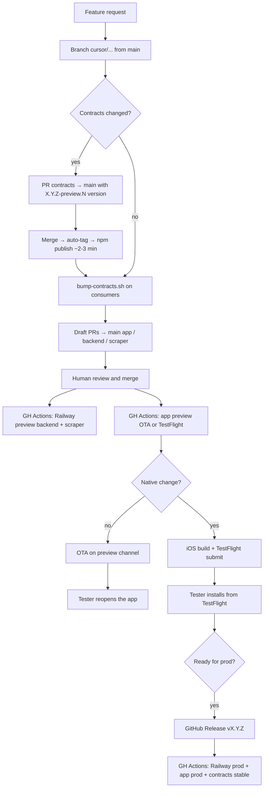

# Plassy Cloud Agent — Preview Workflow

This document describes how Cursor Cloud Agents should work across the Plassy ecosystem to deliver changes testable on a physical iOS device, **without touching production** and **without Metro / ngrok**.

## Goal

When a preview task is requested:

1. Implement changes on dedicated branches from `main`.
2. Open **draft PRs** targeting `main`.
3. After human merge → automatic **preview** deployment (Railway + EAS via GitHub Actions).
4. The tester validates on a physical device (TestFlight or OTA).
5. When ready for production → create a **GitHub Release** / tag `vX.Y.Z` → production deploy.

### Keep in mind (operational defaults)

| Topic | Rule |
| ----- | ---- |
| **Integration branch** | One long-lived branch: `main` everywhere. Preview and prod are **environments**, not branches. Legacy `dev` and `preview` branches are obsolete — deleted after single-branch migration. |
| **Preview trigger** | Merge PR → `main` → GitHub Actions deploy preview (Railway backend/scraper + EAS app). |
| **Production trigger** | `gh release create vX.Y.Z` → GitHub Actions deploy production. |
| **Contracts version** | Whatever is **pinned in each consumer's `package.json`** at build time — not a separate preview branch. When no contracts PR is in flight, preview and prod use the **same** version (currently `3.4.0`). |
| **Contracts preview bump** | Prerelease on `main` (`X.Y.Z-preview.N`) → auto-tag → npm publish → `./scripts/bump-contracts.sh` → consumer PRs → merge → deploy. |
| **Railway auto-deploy** | **Disabled** on both envs. Deploys are CI-only via `railway up` + `RAILWAY_TOKEN_*`. |
| **`NODE_AUTH_TOKEN` (Railway)** | Managed **manually in Railway** (preview **and** production env vars). **Do not** sync from GitHub Actions — the GH token is Actions-scoped and useless on Railway. |
| **Railway deploy success** | `railway up --detach` only confirms the deploy **started**. Always verify build **SUCCESS** on the Railway dashboard or hit the health URL. |
| **Submodule PRs** | Code changes and PRs live **inside each submodule repo**, not the umbrella `Plassy` repo. |

## Single-branch architecture

One long-lived integration branch: **`main`**. Preview and production are **environments**, not branches.

| Layer            | Repo               | PR target | Preview trigger     | Production trigger        |
| ---------------- | ------------------ | --------- | ------------------- | ------------------------- |
| **Mobile app**   | `plassy-app`       | `main`    | push to `main`      | tag `vX.Y.Z` (no preview) |
| **Backend API**  | `plassy-backend`   | `main`    | push to `main`      | tag `vX.Y.Z`              |
| **Scraper**      | `plassy-scraper`   | `main`    | push to `main`      | tag `vX.Y.Z`              |
| **Contracts**    | `plassy-contracts` | `main`    | push to `main`      | tag `vX.Y.Z` (stable)     |
| **Web frontend** | `plassy-frontend`  | `main`    | —                   | —                         |
| **Umbrella**     | `Plassy` (root)    | `dev`     | CI only             | —                         |

### Environments

| Env            | App backend URL                                                         | Deploy mechanism                          | Data                                       |
| -------------- | ----------------------------------------------------------------------- | ----------------------------------------- | ------------------------------------------ |
| **Preview**    | `EXPO_PUBLIC_BACKEND_URL=https://plassy-backend-preview.up.railway.app` | GitHub Actions on push to `main`          | Isolated Neon preview DB, Redis/S3 preview |
| **Production** | `https://api.plassy.fr`                                                 | GitHub Actions on release tag `vX.Y.Z`    | Production                                 |

**Never** point the `preview` profile at `api.plassy.fr`. **Never** use ngrok in an EAS preview build (blocked in code).

Railway **auto-deploy is disabled** on both environments. Deployments are triggered exclusively by GitHub Actions (`railway up` with environment-scoped project tokens).

### Expo / EAS

| Item                  | Value                                                                            |
| --------------------- | -------------------------------------------------------------------------------- |
| Expo org              | `@plassy/plassy`                                                                 |
| Project               | `@plassy/plassy` (`extra.eas.projectId`: `8be05f22-a61c-4959-a5d6-a526667fc22a`) |
| `app.json` → `owner`  | `"plassy"` (must match the Expo org)                                             |
| Connected GitHub repo | `Plassy-App/Plassy-App`                                                          |
| Preview               | GH Action `.github/workflows/preview-deploy.yml` on push to `main`               |
| Production            | GH Action `.github/workflows/deploy-production.yml` on tag `v*`                  |
| Manual fallback       | `.eas/workflows/preview-deploy.yml`, `.eas/workflows/production-deploy.yml`      |
| TestFlight submit     | `submit.preview.ios.ascAppId`: `6762057582`                                      |

## Standard flow (one feature request)



### Agent steps

1. **Initialize submodules** if needed: `git submodule update --init --recursive`.
2. **Create a branch** per touched repo: `cursor/<description>-7c6d` (from `main`).
3. **Implement** changes following each repo's conventions.
4. **Commit and push** on each touched branch (`git push -u origin <branch>`).
5. **Open draft PRs** (mandatory — never leave a task with only a pushed branch):
   - `plassy-app` → base `main`
   - `plassy-backend` → base `main`
   - `plassy-scraper` → base `main`
   - `plassy-contracts` → base `main`
   - umbrella `Plassy` → base `main` (only when root files change)
6. **Describe in each PR**: scope, merge order, expected testing actions.
7. **Wait for human merge** — do not merge unless explicitly instructed.

After merge to `main` (app):

- The GitHub Actions preview workflow triggers **automatically**.
- **JS/TS changes only** → OTA (~2–3 min): the tester **reopens the app**; no new TestFlight build required.
- **Native changes** (Expo plugins, permissions, Mapbox, share extension, `appVersion` bump, etc.) → build + TestFlight submit (~15–25 min): the tester **installs the new build**.

## Contracts (`plassy-contracts`)

The `@plassy-app/api-contracts` package is published to **GitHub Packages**, not deployed on Railway.

### When contracts change

**Mandatory order**:

1. Modify `plassy-contracts` on a branch from `main`.
2. Bump the version as a **prerelease** in `package.json` (e.g. `3.5.0-preview.1`).
3. Update `CHANGELOG.md`.
4. Open a draft PR → `main`.
5. **Merge to main** → `tag-preview.yml` auto-creates `v3.5.0-preview.1` if missing → `publish.yml` publishes (~2–3 min).
   Or push the tag manually before merge:
   ```bash
   git tag v3.5.0-preview.1
   git push origin v3.5.0-preview.1
   ```
6. Wait for the `publish.yml` workflow to finish (~2–3 min).
7. Bump consumers:
   ```bash
   ./scripts/bump-contracts.sh 3.5.0-preview.1
   ```
8. Commit `package.json` + lockfile in `plassy-backend`, `plassy-scraper`, and `plassy-app`.
9. Open PRs for backend/scraper/app → `main`.
10. Human merge → preview deploy via GitHub Actions.

### Production release

1. Bump `package.json` to stable version (e.g. `3.5.0`) on `main`.
2. Create GitHub Release `v3.5.0` → `publish.yml` publishes stable to GitHub Packages.
3. Bump consumers with stable version, merge, then tag app/backend/scraper repos for coordinated prod deploy.

### Accepted tags

The `publish.yml` workflow publishes on:

- `v*.*.*` — stable releases (production)
- `v*.*.*-preview.*` — preview prereleases

### Pinning

Always pin the exact version: `"@plassy-app/api-contracts": "3.5.0-preview.1"` (not `^`).

### Which version does preview use?

Contracts are **npm packages on GitHub Packages**, not Railway services. Each environment uses the version **pinned in `package.json` + lockfile** when that service is built:

| Situation | Preview version | Production version |
| --------- | --------------- | ------------------ |
| No contracts change in flight | Same stable pin (e.g. `3.4.0`) | Same |
| After preview contracts PR merged + consumers bumped | `X.Y.Z-preview.N` | Still old stable until prod release |
| After prod contracts release + consumers bumped | Same stable `X.Y.Z` | Same stable `X.Y.Z` |

The version number (`-preview.N` vs stable) distinguishes preview from prod — **not** a git branch. Consumer bumps are **manual** (`./scripts/bump-contracts.sh`) so you control timing after npm publish (~2–3 min).

## Backend and scraper

- Integration branch: `main`.
- Push to `main` → GitHub Action `deploy-preview.yml` → `railway up --environment preview`.
- Tag `vX.Y.Z` → GitHub Action `deploy-production.yml` → `railway up --environment production`.
- The preview backend talks to the scraper via `SCRAPER_URL` (internal Railway network) and `SCRAPER_INTERNAL_TOKEN` (shared between both preview services).
- `APPSTORE_VERIFICATION_ENV=sandbox` on the preview backend (TestFlight / sandbox purchases).

### Required GitHub secrets (backend + scraper)

| Secret                       | Source                                                              |
| ---------------------------- | ------------------------------------------------------------------- |
| `RAILWAY_TOKEN_PREVIEW`      | Railway project token scoped to **preview** environment             |
| `RAILWAY_TOKEN_PRODUCTION`   | Railway project token scoped to **production** environment          |

Create tokens: Railway dashboard → Project → Settings → [Tokens](https://railway.com/project/11876ed8-5fba-4d54-9f18-cfc667c24554/settings/tokens) (Project Tokens, **not** Account → Tokens).

**`NODE_AUTH_TOKEN` on Railway (preview + production):** GitHub PAT with `read:packages`, set as a Railway **environment variable** on both Plassy-Backend and Plassy-Scraper services. Required for Docker build `bun install` of `@plassy-app/api-contracts`. Update it in Railway when the PAT rotates — do not add it to GitHub Actions secrets for deploy workflows.

### Manual preview deploy (per repo)

Test the auto-deploy pipeline from each repo's Actions tab (not the umbrella `Plassy` repo):

| Repo | Workflow | Link |
| ---- | -------- | ---- |
| `plassy-backend` | Deploy to preview | [deploy-preview.yml](https://github.com/Plassy-App/Plassy-Backend/actions/workflows/deploy-preview.yml) |
| `plassy-scraper` | Deploy to preview | [deploy-preview.yml](https://github.com/Plassy-App/Plassy-Scraper/actions/workflows/deploy-preview.yml) |
| `plassy-app` | Deploy to preview | [preview-deploy.yml](https://github.com/Plassy-App/Plassy-App/actions/workflows/preview-deploy.yml) |

Run workflow → branch `main` → verify GH job green **and** Railway build SUCCESS.

### API coordination

| Change type                          | Order                                             |
| ------------------------------------ | ------------------------------------------------- |
| Optional field added                 | Backend deploy then app update — usually tolerant |
| Required field / stricter validation | **Backend first**, then app                       |
| New route                            | Backend deploy, then app with new client          |
| Field removed / renamed              | Coordinated deploy immediately                    |

## Mobile app (`plassy-app`)

### Build vs OTA (after merge to `main`)

The preview GitHub Action uses fingerprint detection (same logic as before):

| Situation                                  | Result                              | Tester action           |
| ------------------------------------------ | ----------------------------------- | ----------------------- |
| JS/TS only (screens, logic, API client)    | OTA on channel `preview`            | Reopen the app          |
| Native change or no compatible cloud build | `build` + `submit`                  | Install from TestFlight |

Files that are typically **native** (rebuild required):

- `app.json` / `app.config.js` (plugins, permissions, version)
- `ios/`, `android/`
- Custom Expo plugins (`plugins/`)
- Dependencies with native code (Mapbox, native Sentry config, share extension)
- `runtimeVersion` / `appVersion` bump

### Production release

```bash
gh release create v1.2.3 --title "1.2.3" --notes "..."
```

This triggers `deploy-production.yml` which runs `.eas/workflows/production-deploy.yml`.

### EAS variables (environment `preview`)

Configured on expo.dev → Environment variables → `preview`:

- `NODE_AUTH_TOKEN` + `NPM_TOKEN` (same GitHub PAT, scope `read:packages`) — **required** for `@plassy-app/api-contracts`
- `EXPO_PUBLIC_MAPBOX_ACCESS_TOKEN`
- `EXPO_PUBLIC_GOOGLE_CLIENT_ID_IOS`
- `EXPO_PUBLIC_IOS_IAP_*`
- `EXPO_PUBLIC_BACKEND_URL` (redundant with `eas.json`, same Railway preview value)
- `SENTRY_AUTH_TOKEN` (recommended)

`EXPO_PUBLIC_SSL_PIN_SHA256`: **optional** (absent on preview — pinning disabled, acceptable for testing).

### Available Expo MCP tools

The agent can use the Expo MCP (already authenticated) for:

| Action                        | MCP tool                                                          |
| ----------------------------- | ----------------------------------------------------------------- |
| List / track builds           | `build_list`, `build_info`, `build_logs`                          |
| Trigger a manual build        | `build_run`                                                       |
| Submit to TestFlight          | `build_submit`                                                    |
| Run / track workflow          | `workflow_run`, `workflow_list`, `workflow_info`, `workflow_logs` |
| Validate workflow YAML        | `workflow_validate`                                               |
| TestFlight crashes / feedback | `testflight_crashes`, `testflight_feedback`                       |

**Manual OTA** (if needed outside the workflow): no dedicated MCP tool — use the CLI:

```bash
cd plassy-app
eas update --channel preview --message "..." --non-interactive
```

### Re-run preview deploy manually

```bash
cd plassy-app
gh workflow run preview-deploy.yml
# or
eas workflow:run preview-deploy.yml
```

## Git conventions

### Agent branch naming

```
cursor/<short-description>-7c6d
```

Examples: `cursor/fix-login-7c6d`, `cursor/add-place-filter-7c6d`.

### PRs

- **Always open a draft PR** after committing and pushing — a pushed branch alone is not a complete deliverable.
- Always **draft** unless instructed otherwise.
- One PR per touched repo.
- Clear title in English (repo convention).
- PR body: summary, impacted repos, merge order, testing instructions.

#### Opening PRs in submodules

Code changes live in **submodule repos** (`plassy-app`, `plassy-backend`, etc.), not in the umbrella `Plassy` repo. Run git and PR commands **from inside the submodule**:

```bash
cd plassy-app   # or plassy-backend, plassy-scraper, plassy-contracts
git push -u origin cursor/my-fix-7c6d
gh pr create --draft --base main --head cursor/my-fix-7c6d \
  --title "fix: short description" \
  --body "## Summary"
```

| Repo               | PR base branch |
| ------------------ | -------------- |
| `plassy-app`       | `main`         |
| `plassy-backend`   | `main`         |
| `plassy-scraper`   | `main`         |
| `plassy-contracts` | `main`         |
| `Plassy` (umbrella)| `main`         |

The umbrella `Plassy` repo only needs a PR when root files change (e.g. `AGENTS.md`, root scripts). **All repos target `main`** — legacy `dev` and `preview` integration branches are obsolete and deleted.

### Umbrella monorepo

After a submodule PR is merged on GitHub, the latest commit already exists on the remote. To update the submodule pointer in the parent repository, **pull** those changes locally inside the submodule — do not push from the submodule.

```bash
cd plassy-app  # or another submodule
git fetch origin
git checkout origin/main
cd ..
git add plassy-app
git commit -m "chore: bump plassy-app submodule (main)"
git push
```

Only do this when explicitly requested for the umbrella repo.

## Expected deliverables per task

At the end of a preview task:

1. **Branches + draft PRs** on each concerned repo — confirm each PR URL before closing the task.
2. **Contracts tag** published if applicable (prerelease version).
3. **Merge instructions**: order when multiple PRs exist (contracts → backend/scraper → app).
4. **After merge** (if requested): verify the GitHub Action / EAS workflow and confirm OTA or TestFlight build.
5. **Testing message**:
   - OTA: "Merge complete — reopen the preview app to fetch the update"
   - Native: "Merge complete — new TestFlight build in ~20 min"
   - Backend: "Preview API redeployed on Railway"

When the user also asked to **create a Linear task**, include the issue URL; follow `.cursor/rules/linear-task-creation.mdc` (French title + description).

## Secrets & credentials (where each value lives)

Do not duplicate secrets across platforms unless documented here. Wrong placement is the most common deploy failure.

| Secret / variable | Cursor Cloud VM | GitHub Actions (umbrella) | GitHub Actions (backend/scraper) | GitHub Actions (app) | Railway (preview + prod) | EAS (`preview` env) |
| ----------------- | --------------- | ------------------------- | -------------------------------- | -------------------- | ------------------------ | ------------------- |
| `GH_TOKEN` / `SUBMODULES_PAT` | ✅ submodule clone | ✅ migration scripts (`repo` + `workflow`) | — | — | — | — |
| `RAILWAY_TOKEN_PREVIEW` | — | — | ✅ deploy preview | — | — | — |
| `RAILWAY_TOKEN_PRODUCTION` | — | — | ✅ deploy production | — | — | — |
| `NODE_AUTH_TOKEN` | optional (local bun link workaround) | — | ❌ **not used** (do not sync to Railway) | — | ✅ Docker build `bun install` | ✅ + `NPM_TOKEN` for builds |
| `EXPO_TOKEN` | — | — | — | ✅ EAS workflows | — | — |
| `EXPO_PUBLIC_*`, Mapbox, IAP, Sentry | — | — | — | — | — | ✅ expo.dev env vars |

**Railway Project Tokens:** create at Project → Settings → Tokens, one per environment (preview / production). Paste the **full** token once at creation — the masked `****-b423` suffix is not the secret value.

**Before first production release:** confirm `NODE_AUTH_TOKEN` exists on Railway **production** env (backend + scraper), not just preview.

## Prohibited actions

| Action                                          | Why                                             |
| ----------------------------------------------- | ----------------------------------------------- |
| `EXPO_PUBLIC_BACKEND_URL` with ngrok in preview | Crash on startup (guard in `lib/api/client.ts`) |
| Preview → `api.plassy.fr`                       | Risk to production data                         |
| `eas build --profile production` for testing    | Reserved for store releases                     |
| `bun link` contracts in CI/EAS                  | Local dev only — use npm publish                |
| Merge without review unless explicitly asked    | Human gate is intentional                       |
| Sync `NODE_AUTH_TOKEN` from GitHub Actions to Railway | GH token is Actions-scoped; Railway build needs a PAT in Railway env vars |
| Trust GH Action green alone for Railway deploy    | `railway up --detach` does not wait for build completion |

## Git / PR troubleshooting

| Error                                                                     | Likely cause                                              | Fix                                                                                                            |
| ------------------------------------------------------------------------- | --------------------------------------------------------- | -------------------------------------------------------------------------------------------------------------- |
| `Resource not accessible by integration` on `gh pr create` in a submodule | Cursor GitHub App not installed on that submodule repo    | Install the app on `Plassy-App/Plassy-App` (and other submodules), or open the PR manually via the compare URL |
| PR tool targets umbrella repo only                                        | `ManagePullRequest` runs against `Plassy`, not submodules | Use `gh pr create` from inside the submodule (`cd plassy-app`)                                                 |
| Railway deploy fails with `Invalid RAILWAY_TOKEN`                         | Account token or masked suffix pasted instead of full Project Token | Regenerate at Railway Project → Settings → Tokens; paste the **full** UUID shown once at creation |
| Railway GH Action green but Railway build FAILED                          | `railway up --detach` does not wait for build               | Check Railway dashboard build logs; common cause: expired `NODE_AUTH_TOKEN` on Railway (401 on GitHub Packages) |
| Railway deploy fails with 401 on GitHub Packages during Docker build      | Missing or expired `NODE_AUTH_TOKEN` **on Railway**         | Update PAT (`read:packages`) in Railway env vars for preview **and** production — not in GH Actions secrets      |

Fallback compare URL (replace `<branch>`):

`https://github.com/Plassy-App/Plassy-App/compare/main...<branch>`

## EAS workflow troubleshooting

| Error                                   | Likely cause                                                 | Fix                                                 |
| --------------------------------------- | ------------------------------------------------------------ | --------------------------------------------------- |
| `401` on `@plassy-app/api-contracts`    | Invalid `NODE_AUTH_TOKEN` / `NPM_TOKEN` in EAS `preview` env | Recreate secrets on expo.dev                        |
| Owner mismatch (`sweizeur` vs `plassy`) | `app.json` → `owner` not aligned with Expo org               | `"owner": "plassy"`                                 |
| `No repository found for appId`         | GitHub repo not connected to EAS                             | Connect `Plassy-App/Plassy-App` under org `@plassy` |
| OTA does not apply                      | App installed from a `--local` build                         | Install the cloud preview build via TestFlight      |
| Workflow skips OTA, runs build          | First cloud build or native change                           | Expected — wait for TestFlight                      |

## Linear (issue tracking)

When creating or updating a task, follow **`.cursor/rules/linear-task-creation.mdc`**:

- **Titre et description en français**
- Project `Version 1`, labels (`UX`, `Design`, `Backend`, … — pas `UI`), team Dev/Design
- Linear MCP (`save_issue`, …)

Project board: [Version 1](https://linear.app/plassy/project/version-1-ee36a8c46464)

## References

| File                                                                           | Role                                  |
| ------------------------------------------------------------------------------ | ------------------------------------- |
| `plassy-app/eas.json`                                                          | Preview / production build profiles   |
| `plassy-app/.github/workflows/preview-deploy.yml`                              | Auto preview on push to main          |
| `plassy-app/.github/workflows/deploy-production.yml`                           | Production on release tag             |
| `plassy-backend/.github/workflows/deploy-preview.yml`                          | Railway preview deploy                |
| `plassy-backend/.github/workflows/deploy-production.yml`                       | Railway production deploy             |
| `scripts/single-branch-migration/apply-migration.sh`                           | One-shot migration script             |
| `scripts/bump-contracts.sh`                                                    | Bump consumers after publish          |
| `scripts/init-submodules.sh`                                                   | Cloud Agent submodule init (HTTPS + token) |
| `.cursor/environment.json`                                                       | Cloud Agent VM install recipe         |
| `.cursor/rules/*.mdc`                                                            | Scoped agent rules (Linear, contracts) |
| `plassy-contracts/.github/workflows/tag-preview.yml`                           | Auto-tag preview versions on main     |
| `plassy-contracts/.github/workflows/publish.yml`                               | npm publish (stable + preview tags)   |
| `README.md`                                                                    | Monorepo setup, root scripts          |
| [Linear — Version 1](https://linear.app/plassy/project/version-1-ee36a8c46464) | V1 backlog, Dev + Design issues       |

## Quick checklist by task type

### App UI / logic only

- [ ] Branch `cursor/...` from `main` in `plassy-app`
- [ ] Draft PR → `main`
- [ ] Merge → automatic OTA

### Backend only (same contract)

- [ ] Branch from `main` in `plassy-backend` (+ scraper if scraping is impacted)
- [ ] Draft PR → `main`
- [ ] Merge → Railway preview deploy

### Full-stack with contracts

- [ ] PR with `X.Y.Z-preview.N` version on `plassy-contracts` → `main`
- [ ] Wait for npm publish (auto-tag on merge)
- [ ] `bump-contracts.sh` + PRs for backend/scraper/app → `main`
- [ ] Merge backend/scraper first, then app
- [ ] Verify preview deploy

### Native app change

- [ ] PR → `main`
- [ ] Merge → build + TestFlight (not OTA alone)
- [ ] Notify that a new TestFlight build must be installed

### Production release

- [ ] Validate on preview (merge to `main` tested)
- [ ] `gh release create vX.Y.Z` on each touched repo (or monorepo tag)
- [ ] Verify Railway production + EAS production workflows

## Cursor Cloud Agent — configuration map

Cloud Agents run in isolated Ubuntu VMs. Configuration is **layered** — not limited to `.cursor/environment.json` and `AGENTS.md` alone.

Docs: [Cloud Agents](https://cursor.com/docs/cloud-agent) · [Environment setup](https://cursor.com/docs/cloud-agent/setup) · [Capabilities](https://cursor.com/docs/cloud-agent/capabilities) · [Settings](https://cursor.com/docs/cloud-agent/settings) · [Hooks](https://cursor.com/docs/hooks)

### What Plassy uses today

| Mechanism | Path / location | Role in Plassy |
| --------- | --------------- | -------------- |
| **Environment recipe** | `.cursor/environment.json` | `install`: submodule init + `bun install` |
| **Agent instructions** | `AGENTS.md` (this file) | Preview workflow, contracts order, git/PR rules, VM gotchas |
| **Scoped rules** | `.cursor/rules/*.mdc` | Linear task creation, contracts bump/link conventions |
| **MCP servers** | Cursor dashboard (team) | Linear, Expo, Neon, Railway — configured in [Cloud Agents → MCP](https://cursor.com/agents) |
| **Runtime secrets** | Cursor dashboard → Secrets | `GH_TOKEN` or `SUBMODULES_PAT` for private submodule clone (see `scripts/init-submodules.sh`) |

### Full configuration surface (reference)

Use this when extending the Cloud Agent setup beyond the current minimum.

| Mechanism | Where | What it controls | Cloud Agent support |
| --------- | ----- | ---------------- | ------------------- |
| **`environment.json`** | `.cursor/environment.json` | VM recipe: `install` (idempotent update), optional `start`, `terminals`, `env`, `snapshot`, or `build.dockerfile` | ✅ Primary repo-level config; takes precedence over dashboard saved envs |
| **`AGENTS.md`** | Repo root (nested in subdirs for subprojects) | Persistent instructions — read by **local Agent and Cloud Agents** | ✅ Recommended; use a `Cursor Cloud specific instructions` section for VM-only notes |
| **`CLOUD.md`** | `.cursor/CLOUD.md` | Cloud-only instructions (local IDE ignores this file) | ✅ Optional split if cloud-only content grows large |
| **Project rules** | `.cursor/rules/*.mdc` | Scoped rules with `globs`, `alwaysApply`, or `metadata.environments: cloud` for cloud-only rules | ✅ `linear-task-creation.mdc`, `api-contracts-bun-link.mdc` |
| **Hooks** | `.cursor/hooks.json` | Command hooks: `beforeShellExecution`, `afterFileEdit`, `preToolUse`, `subagentStart`, etc. | ✅ Project hooks run in cloud; user-level `~/.cursor/hooks.json` does **not** |
| **MCP servers** | Dashboard and/or `.cursor/mcp.json` | External tools (DB, APIs, Expo builds, Linear issues) | ✅ HTTP (recommended) or stdio; team MCP via dashboard → Integrations |
| **Cursor Secrets** | [cursor.com/dashboard/cloud-agents](https://cursor.com/dashboard/cloud-agents) | Env vars injected into the VM (`GH_TOKEN`, API keys, TOTP secrets) | ✅ Preferred over committing `.env` files |
| **Environment-scoped secrets** | Cloud Agents dashboard → per-environment | Secrets limited to one saved environment / repo group | Optional — useful for staging vs prod credentials |
| **Multi-repo environment** | Dashboard → Environments | Clone multiple repos into one VM (alternative to git submodules) | Plassy uses **submodules** in one umbrella repo instead |
| **Snapshot vs Dockerfile** | `environment.json` → `snapshot` or `build.dockerfile` | Snapshot = fast boot from cached VM; Dockerfile = reproducible system deps (Postgres, Playwright, Docker-in-Docker) | Snapshot optional after guided setup; Dockerfile for advanced deps |
| **`start` + `terminals`** | `environment.json` | Long-running processes in tmux (dev servers, `docker start`, `convex dev`) | Not configured yet — agent starts services on demand per AGENTS.md |
| **Network allowlist** | Dashboard → Environment → Network | Restrict outbound domains per environment | Default + allowlist or allowlist-only |
| **Private network** | Dockerfile / setup | Tailscale (userspace mode) or Cloudflare Tunnel for VPC/intranet | Not configured — preview APIs are public Railway URLs |
| **AWS IAM role** | Secret `CURSOR_AWS_ASSUME_IAM_ROLE_ARN` | STS-assumed AWS access without long-lived keys | Not used |
| **Artifacts & desktop** | Built-in | Screenshots, videos, logs on PRs; remote desktop control | Available — useful for UI verification |
| **CI autofix** | Dashboard → My Settings | Cloud Agent auto-fixes CI on its own PRs (GitHub Actions) | Teams feature; comment `@cursor autofix off` on a PR to disable |
| **Triggers** | Slack `@cursor`, Linear `@cursor`, GitHub PR comments, API, iOS app | Start agents from outside the IDE | Available |

### Environment resolution order

When a Cloud Agent starts, Cursor picks the environment config in this order:

1. `.cursor/environment.json` in the repo (Plassy uses this)
2. Personal saved environment (dashboard)
3. Team saved environment (dashboard)

Commit `environment.json` so the team shares the same VM recipe. Test config changes by pushing to a branch and starting an agent from that branch.

### Plassy `environment.json` today

```json
{
  "name": "Plassy umbrella",
  "install": "bash scripts/init-submodules.sh && bun install"
}
```

The `install` script must stay **idempotent** — it may run on partially cached state. Keep heavy one-off setup (Playwright browsers, Postgres extension, contracts `bun link`) in AGENTS.md instructions or extend `install` / a Dockerfile when needed.

**Required Cursor Secret:** `GH_TOKEN` or `SUBMODULES_PAT` with `repo` scope (and `read:packages` if the token is reused elsewhere). Without it, `scripts/init-submodules.sh` fails on private submodule clone.

### Optional improvements (not yet configured)

| Need | Add |
| ---- | --- |
| Cloud-only rules without polluting local IDE | `.cursor/CLOUD.md` or `metadata.environments: cloud` in `.mdc` rules |
| Auto-format / policy checks in cloud | `.cursor/hooks.json` with `afterFileEdit` |
| Postgres + Redis always running | `start` or `terminals` in `environment.json`, or Postgres in Dockerfile |
| Faster repeat boots | Save a dashboard snapshot after guided setup; reference `"snapshot": "..."` in `environment.json` |
| Submodule repo-specific agent docs | Nested `AGENTS.md` inside `plassy-app/`, `plassy-backend/`, etc. (nearest file wins) |

## Cursor Cloud specific instructions

Durable, non-obvious notes for running this monorepo inside a Cursor Cloud Agent VM (headless Linux). The startup `install` script runs submodule init + root `bun install`. Standard commands live in `README.md` and each `package.json`; only the gotchas are listed here.

### What runs on the cloud VM (and what does not)

- **plassy-app is iOS/Android only and does NOT run on the web.** Do not attempt Expo web ("bun run web") as a way to "run" the product — react-native-web is incompatible (e.g. "Appearance.setColorScheme" is missing) and "@rnmapbox/maps" needs a "mapbox-gl" web peer that is intentionally not a dependency. On the VM, validate the app only via individual commands: "bun run --cwd plassy-app typecheck", "bun run --cwd plassy-app test", or "bun run --cwd plassy-app lint" (and the Metro bundler can start). The real run target is a physical device via EAS/TestFlight — see the preview workflow above.
- **Runnable services on the VM:** `plassy-backend` (`:3001`), `plassy-scraper` (`:3002`), `plassy-frontend` (`:3000`). These are what to exercise for end-to-end checks here.

### Private contracts package (`@plassy-app/api-contracts`)

- Consumers (`plassy-backend`, `plassy-scraper`, `plassy-app`) depend on this private GitHub Packages package. The cloud `GH_TOKEN` does **not** have `read:packages`, so registry installs return `401`.
- Local-dev workaround (handled by the update script): build `plassy-contracts` then `bun link` it, and `bun link @plassy-app/api-contracts` inside each consumer before `bun install`. Once linked, `bun install` no longer hits the registry. If a consumer suddenly fails to resolve the package, re-run `bun link @plassy-app/api-contracts` in that folder.

### Backend (`plassy-backend`)

- Local **PostgreSQL 16** and **Redis** are installed in the VM and started with "sudo service postgresql start" and "sudo service redis-server start" (no systemd in the VM, but sysvinit service wrappers are available). DB/user: "plassy" / "plassy", database "plassy".
- The Prisma schema relies on the **`pg_uuidv7`** extension (`uuid_generate_v7()`), which is **not** in stock Postgres — it is installed into the cluster from `fboulnois/pg_uuidv7`. Apply schema with `bunx prisma migrate deploy` (the `init` migration runs `CREATE EXTENSION pg_uuidv7`). Do **not** use `prisma db push` for a fresh DB: it tries to create tables before the extension exists and fails with `function uuid_generate_v7() does not exist`.
- **Boot gotcha:** `src/services/places/enrichment/llm-extractor.ts` constructs the OpenAI client at import time, so the backend **refuses to start without a non-empty `OPENAI_API_KEY`**, even though env validation marks it optional. A placeholder value (e.g. `sk-placeholder-...`) lets it boot; real AI features need a real key.
- `/health` reports `"degraded"` with `redis:"disconnected"` in dev — this is expected (ioredis lazy-connects; Redis is optional in dev). `database:"connected"` is the signal the DB is wired correctly. `GET /api/hello` → `{"ok":true}` is a quick liveness check.
- `.env` files are gitignored and created during setup ("cp .env.example .env"). Minimum to boot: "DATABASE_URL", "NODE_ENV=development", "OPENAI_API_KEY" (placeholder ok), and "SCRAPER_INTERNAL_TOKEN" (to match the scraper).

### Scraper (`plassy-scraper`)

- Boots without browsers, but **actual scraping needs Playwright Chromium**: `cd plassy-scraper && bunx playwright install --with-deps chromium` (installed once in the VM snapshot, not in the update script).
- `/scrape/*` is protected by the `x-scraper-token` header which must equal `SCRAPER_INTERNAL_TOKEN`; the same value must be set in the backend `.env`. Generate with `openssl rand -hex 32`.
- From a datacenter IP, Instagram/TikTok often return bot-wall pages, so OG titles may be generic (e.g. `"TikTok - Make Your Day"`). The pipeline still runs end-to-end; this is a network/IP limitation, not a code error.
