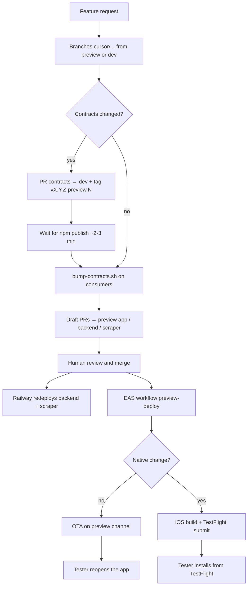

# Plassy Cloud Agent — Preview Workflow

This document describes how Cursor Cloud Agents should work across the Plassy ecosystem to deliver changes testable on a physical iOS device, **without touching production** and **without Metro / ngrok**.

## Goal

When a preview task is requested:

1. Implement changes on dedicated branches.
2. Open **draft PRs** targeting preview integration branches.
3. After human merge → automatic deployment (Railway + EAS).
4. The tester validates on a physical device (TestFlight or OTA).

## Preview architecture

| Layer            | Repo               | PR target branch | Deployment                               | URL / channel                                   |
| ---------------- | ------------------ | ---------------- | ---------------------------------------- | ----------------------------------------------- |
| **Mobile app**   | `plassy-app`       | `preview`        | EAS Workflow on push to `preview`        | OTA channel `preview`, TestFlight               |
| **Backend API**  | `plassy-backend`   | `preview`        | Railway auto-deploy on push to `preview` | `https://plassy-backend-preview.up.railway.app` |
| **Scraper**      | `plassy-scraper`   | `preview`        | Railway auto-deploy on push to `preview` | Private Railway network (`*.railway.internal`)  |
| **Contracts**    | `plassy-contracts` | `dev`            | npm tag → GitHub Packages                | No `preview` branch                             |
| **Web frontend** | `plassy-frontend`  | `dev` or `main`  | Out of mobile preview scope              | —                                               |
| **Umbrella**     | `Plassy` (root)    | `main` / `dev`   | CI only                                  | —                                               |

### Environments

| Env            | App backend URL                                                         | Railway branch | Data                                       |
| -------------- | ----------------------------------------------------------------------- | -------------- | ------------------------------------------ |
| **Preview**    | `EXPO_PUBLIC_BACKEND_URL=https://plassy-backend-preview.up.railway.app` | `preview`      | Isolated Neon preview DB, Redis/S3 preview |
| **Production** | `https://api.plassy.fr`                                                 | `main`         | Production                                 |

**Never** point the `preview` profile at `api.plassy.fr`. **Never** use ngrok in an EAS preview build (blocked in code).

### Expo / EAS

| Item                  | Value                                                                            |
| --------------------- | -------------------------------------------------------------------------------- |
| Expo org              | `@plassy/plassy`                                                                 |
| Project               | `@plassy/plassy` (`extra.eas.projectId`: `8be05f22-a61c-4959-a5d6-a526667fc22a`) |
| `app.json` → `owner`  | `"plassy"` (must match the Expo org)                                             |
| Connected GitHub repo | `Plassy-App/Plassy-App`                                                          |
| Build profile         | `preview` (`distribution: store`, `environment: preview`, channel `preview`)     |
| Workflow              | `.eas/workflows/preview-deploy.yml` (trigger `on.push: preview`)                 |
| TestFlight submit     | `submit.preview.ios.ascAppId`: `6762057582`                                      |

## Standard flow (one feature request)



### Agent steps

1. **Initialize submodules** if needed: `git submodule update --init --recursive`.
2. **Create a branch** per touched repo: `cursor/<description>-7c6d` (from `preview` for app/backend/scraper, from `dev` for contracts).
3. **Implement** changes following each repo's conventions.
4. **Commit and push** on each touched branch (`git push -u origin <branch>`).
5. **Open draft PRs** (mandatory — never leave a task with only a pushed branch):
   - `plassy-app` → base `preview`
   - `plassy-backend` → base `preview`
   - `plassy-scraper` → base `preview`
   - `plassy-contracts` → base `dev`
   - umbrella `Plassy` → base `dev` or `main` (only when root files change)
6. **Describe in each PR**: scope, merge order, expected testing actions.
7. **Wait for human merge** — do not merge unless explicitly instructed.

After merge to `preview` (app):

- The EAS workflow triggers **automatically**.
- **JS/TS changes only** → OTA (~2–3 min): the tester **reopens the app**; no new TestFlight build required.
- **Native changes** (Expo plugins, permissions, Mapbox, share extension, `appVersion` bump, etc.) → build + TestFlight submit (~15–25 min): the tester **installs the new build**.

## Contracts (`plassy-contracts`)

The `@plassy-app/api-contracts` package is published to **GitHub Packages**, not deployed on Railway.

### When contracts change

**Mandatory order**:

1. Modify `plassy-contracts` on a branch from `dev`.
2. Bump the version as a **prerelease** in `package.json` (e.g. `3.5.0-preview.1`).
3. Update `CHANGELOG.md`.
4. Open a draft PR → `dev`.
5. **Push the tag** (triggers publish, even if the PR is still open):
   ```bash
   git tag v3.5.0-preview.1
   git push origin v3.5.0-preview.1
   ```
6. Wait for the `publish.yml` workflow to finish (~2–3 min).
7. Bump consumers:
   ```bash
   ./scripts/bump-contracts.sh 3.5.0-preview.1
   ```
8. Commit `package.json` + lockfile in `plassy-backend`, `plassy-scraper`, and `plassy-app`.
9. Open PRs for backend/scraper/app → `preview`.
10. Human merge → Railway then EAS.

### Accepted tags

The `publish.yml` workflow publishes on:

- `v*.*.*` — stable releases (production)
- `v*.*.*-preview.*` — preview prereleases

**Never** bump `main` (production) with a `-preview` version.

### Pinning

Always pin the exact version: `"@plassy-app/api-contracts": "3.5.0-preview.1"` (not `^`).

## Backend and scraper

- Integration branch: `preview`.
- Push / merge to `preview` → Railway auto-redeploys the preview environment.
- The preview backend talks to the scraper via `SCRAPER_URL` (internal Railway network) and `SCRAPER_INTERNAL_TOKEN` (shared between both preview services).
- `APPSTORE_VERIFICATION_ENV=sandbox` on the preview backend (TestFlight / sandbox purchases).

### API coordination

| Change type                          | Order                                             |
| ------------------------------------ | ------------------------------------------------- |
| Optional field added                 | Backend deploy then app update — usually tolerant |
| Required field / stricter validation | **Backend first**, then app                       |
| New route                            | Backend deploy, then app with new client          |
| Field removed / renamed              | Coordinated deploy immediately                    |

## Mobile app (`plassy-app`)

### Build vs OTA (after merge to `preview`)

The `.eas/workflows/preview-deploy.yml` workflow decides automatically via **fingerprint**:

| Situation                                  | Workflow result                     | Tester action           |
| ------------------------------------------ | ----------------------------------- | ----------------------- |
| JS/TS only (screens, logic, API client)    | `type: update` on channel `preview` | Reopen the app          |
| Native change or no compatible cloud build | `type: build` + `type: submit`      | Install from TestFlight |

Files that are typically **native** (rebuild required):

- `app.json` / `app.config.js` (plugins, permissions, version)
- `ios/`, `android/`
- Custom Expo plugins (`plugins/`)
- Dependencies with native code (Mapbox, native Sentry config, share extension)
- `runtimeVersion` / `appVersion` bump

### EAS variables (environment `preview`)

Configured on expo.dev → Environment variables → `preview`:

- `NODE_AUTH_TOKEN` + `NPM_TOKEN` (same GitHub PAT, scope `read:packages`) — **required** for `@plassy-app/api-contracts`
- `EXPO_PUBLIC_MAPBOX_ACCESS_TOKEN`
- `EXPO_PUBLIC_GOOGLE_CLIENT_ID_IOS`
- `EXPO_PUBLIC_IOS_IAP_*`
- `EXPO_PUBLIC_BACKEND_URL` (redundant with `eas.json`, same Railway preview value)
- `SENTRY_AUTH_TOKEN` (recommended)

`EXPO_PUBLIC_SSL_PIN_SHA256`: **optional** (absent on preview — pinning disabled, acceptable for testing).

### Available Expo MCP tools

The agent can use the Expo MCP (already authenticated) for:

| Action                        | MCP tool                                                          |
| ----------------------------- | ----------------------------------------------------------------- |
| List / track builds           | `build_list`, `build_info`, `build_logs`                          |
| Trigger a manual build        | `build_run`                                                       |
| Submit to TestFlight          | `build_submit`                                                    |
| Run / track workflow          | `workflow_run`, `workflow_list`, `workflow_info`, `workflow_logs` |
| Validate workflow YAML        | `workflow_validate`                                               |
| TestFlight crashes / feedback | `testflight_crashes`, `testflight_feedback`                       |

**Manual OTA** (if needed outside the workflow): no dedicated MCP tool — use the CLI:

```bash
cd plassy-app
eas update --channel preview --message "..." --non-interactive
```

### Re-run the workflow manually

```bash
cd plassy-app
eas workflow:run preview-deploy.yml --ref preview
```

Or via MCP: `workflow_run` with `workflowFile: "preview-deploy.yml"`, `gitRef: "preview"`.

## Git conventions

### Agent branch naming

```
cursor/<short-description>-7c6d
```

Examples: `cursor/fix-login-preview-7c6d`, `cursor/add-place-filter-7c6d`.

### PRs

- **Always open a draft PR** after committing and pushing — a pushed branch alone is not a complete deliverable.
- Always **draft** unless instructed otherwise.
- One PR per touched repo.
- Clear title in English (repo convention).
- PR body: summary, impacted repos, merge order, testing instructions.

#### Opening PRs in submodules

Code changes live in **submodule repos** (`plassy-app`, `plassy-backend`, etc.), not in the umbrella `Plassy` repo. Run git and PR commands **from inside the submodule**:

```bash
cd plassy-app   # or plassy-backend, plassy-scraper, plassy-contracts
git push -u origin cursor/my-fix-7c6d
gh pr create --draft --base <base-branch> --head cursor/my-fix-7c6d \
  --title "fix: short description" \
  --body "## Summary"
```

| Repo               | PR base branch |
| ------------------ | -------------- |
| `plassy-app`       | `preview`      |
| `plassy-backend`   | `preview`      |
| `plassy-scraper`   | `preview`      |
| `plassy-contracts` | `dev`          |

The umbrella `Plassy` repo only needs a PR when root files change (e.g. `AGENTS.md`, root scripts).

### Umbrella monorepo

After a submodule PR is merged on GitHub, the latest commit already exists on the remote. To update the submodule pointer in the parent repository, **pull** those changes locally inside the submodule — do not push from the submodule.

```bash
cd plassy-app  # or another submodule
git fetch origin
git checkout origin/preview
cd ..
git add plassy-app
git commit -m "chore: bump plassy-app submodule (preview)"
git push
```

Only do this when explicitly requested for the umbrella repo.

## Expected deliverables per task

At the end of a preview task:

1. **Branches + draft PRs** on each concerned repo — confirm each PR URL before closing the task.
2. **Contracts tag** published if applicable (prerelease version).
3. **Merge instructions**: order when multiple PRs exist (contracts → backend/scraper → app).
4. **After merge** (if requested): verify the EAS workflow via MCP and confirm OTA or TestFlight build.
5. **Testing message**:
   - OTA: "Merge complete — reopen the preview app to fetch the update"
   - Native: "Merge complete — new TestFlight build in ~20 min"
   - Backend: "Preview API redeployed on Railway"

When the user also asked to **create a Linear task**, include the issue URL and confirm project / milestone / labels match the [Linear section](#linear-issue-tracking).

## Prohibited actions

| Action                                          | Why                                             |
| ----------------------------------------------- | ----------------------------------------------- |
| `EXPO_PUBLIC_BACKEND_URL` with ngrok in preview | Crash on startup (guard in `lib/api/client.ts`) |
| Preview → `api.plassy.fr`                       | Risk to production data                         |
| `eas build --profile production` for testing    | Reserved for store releases                     |
| `bun link` contracts in CI/EAS                  | Local dev only — use npm publish                |
| Bump `main` with a `-preview` version           | Keeps production isolated from prereleases      |
| Merge without review unless explicitly asked    | Human gate is intentional                       |

## Git / PR troubleshooting

| Error                                                                     | Likely cause                                              | Fix                                                                                                            |
| ------------------------------------------------------------------------- | --------------------------------------------------------- | -------------------------------------------------------------------------------------------------------------- |
| `Resource not accessible by integration` on `gh pr create` in a submodule | Cursor GitHub App not installed on that submodule repo    | Install the app on `Plassy-App/Plassy-App` (and other submodules), or open the PR manually via the compare URL |
| PR tool targets umbrella repo only                                        | `ManagePullRequest` runs against `Plassy`, not submodules | Use `gh pr create` from inside the submodule (`cd plassy-app`)                                                 |

Fallback compare URL (replace `<branch>`):

`https://github.com/Plassy-App/Plassy-App/compare/preview...<branch>`

## EAS workflow troubleshooting

| Error                                   | Likely cause                                                 | Fix                                                 |
| --------------------------------------- | ------------------------------------------------------------ | --------------------------------------------------- |
| `401` on `@plassy-app/api-contracts`    | Invalid `NODE_AUTH_TOKEN` / `NPM_TOKEN` in EAS `preview` env | Recreate secrets on expo.dev                        |
| Owner mismatch (`sweizeur` vs `plassy`) | `app.json` → `owner` not aligned with Expo org               | `"owner": "plassy"`                                 |
| `No repository found for appId`         | GitHub repo not connected to EAS                             | Connect `Plassy-App/Plassy-App` under org `@plassy` |
| OTA does not apply                      | App installed from a `--local` build                         | Install the cloud preview build via TestFlight      |
| Workflow skips OTA, runs build          | First cloud build or native change                           | Expected — wait for TestFlight                      |

## Linear (issue tracking)

Use the **Linear MCP** (`save_issue`, `list_issues`, `get_project`, …) when the user asks to create, update, or triage a **task / issue / ticket**. Follow the workspace structure below — do not invent ad-hoc projects, teams, or labels.

### Workspace layout

| Concept          | Value                                                               |
| ---------------- | ------------------------------------------------------------------- |
| **Project**      | `Version 1` — all in-scope V1 work                                  |
| **Team Dev**     | `Plassy - Dev` (key `PLA1`) — app + backend implementation          |
| **Team Design**  | `Plassy - Design` (key `PLA2`) — visual specs, logo, DA, UI handoff |
| **Project lead** | Anthony                                                             |

**Out of scope for `Version 1`:** post-launch features, non-blocking refactors (see project description on Linear). Create without a project only if explicitly post-V1.

### Milestones (pick exactly one)

| Milestone                 | When to use                                                                        |
| ------------------------- | ---------------------------------------------------------------------------------- |
| **Feedback testeurs**     | Copy, onboarding, empty states, user-facing messages, tester feedback              |
| **Stabilisation preview** | Bugs, security, rate limits, technical polish before wider TestFlight              |
| **Design V1**             | Logo, DA, design tokens, filter/card visual specs — work **before** Dev implements |
| **Launch App Store**      | Store assets, production build, submission, privacy / compliance blockers          |

If unsure between **Feedback testeurs** and **Stabilisation preview**: user-visible wording/UX → Feedback; broken behaviour or infra → Stabilisation.

### Labels (mandatory)

Use workspace labels — **never** create duplicates.

| Label         | Use with                           | Meaning                                  |
| ------------- | ---------------------------------- | ---------------------------------------- |
| `UX`          | `Improvement` or `Feature`         | Copy, flows, onboarding, messages métier |
| `UI`          | `Improvement` or `Feature`         | Visual design, components, specs Figma   |
| `Backend`     | `Bug` or `Improvement`             | API, scraper, security, infra            |
| `Bug`         | alone or + `Backend`               | Defect                                   |
| `Feature`     | alone or + `UX` / `UI`             | New capability                           |
| `Improvement` | alone or + `UX` / `UI` / `Backend` | Enhancement to existing behaviour        |

Examples: UX copy fix → `UX` + `Improvement`. Security fix → `Backend` + `Bug`. New logo → `UI` + `Feature`.

### Creating an issue (agent checklist)

When the user asks to **create a task**:

1. **Title** — French, action-oriented (same style as existing issues, e.g. `Onboarding : clarifier la proposition de valeur`).
2. **Team** — per routing table above.
3. **Project** — `Version 1` (unless explicitly out of scope).
4. **Milestone** — one from the table above.
5. **Labels** — 1–2 from the table above; never `Design`.
6. **Priority** — `Urgent` / `High` only if blocking release or preview; default `Medium` or `Low`.
7. **Description** — Markdown with this structure:

   ```markdown
   ## Problème

   (why this matters for users or release)

   ## Déjà en place (code)

   (relevant files / behaviour — search the repo first)

   ## À faire

   - [ ] …

   ## Fichiers clés

   - `path/to/file.ts`
   ```

8. **Links** — if a PR already exists, attach it via `links` on `save_issue`.
9. **Confirm** — return the Linear issue URL and identifier (e.g. `PLA1-17`).

Use `save_issue` with at minimum: `title`, `team`, `project`, `milestone`, `labels`, `description`. Set `assignee` when obvious from the routing table.

### Updating an issue

When moving work forward (preview task done, PR opened):

- Set status via `state` if the user asks (e.g. `In Progress`, `Testing`).
- Keep `project`, `milestone`, and labels consistent — fix mis-tagged issues instead of leaving them orphan.
- Link PRs to the issue (`links`); branch names often follow `sweizeur/pla1-XX-…`.

### What not to do

| Action                                        | Why                                           |
| --------------------------------------------- | --------------------------------------------- |
| Create issues without `Version 1` for V1 work | Breaks milestone progress and cross-team view |
| Use label `Design`                            | Renamed to `UI`                               |
| Put design specs on `Plassy - Dev`            | Design team owns visual deliverables          |
| Skip milestone or labels                      | Makes project views useless                   |
| Create a second catch-all project             | `Version 1` is the single release container   |

## References

| File                                                                           | Role                                  |
| ------------------------------------------------------------------------------ | ------------------------------------- |
| `plassy-app/eas.json`                                                          | Preview build/submit profiles         |
| `plassy-app/.eas/workflows/preview-deploy.yml`                                 | Auto preview CI/CD                    |
| `plassy-app/app.json`                                                          | Expo owner, projectId, runtimeVersion |
| `scripts/bump-contracts.sh`                                                    | Bump consumers after publish          |
| `plassy-contracts/MIGRATION.md`                                                | Contracts release cycle               |
| `plassy-contracts/.github/workflows/publish.yml`                               | npm publish (stable + preview tags)   |
| `README.md`                                                                    | Monorepo setup, root scripts          |
| [Linear — Version 1](https://linear.app/plassy/project/version-1-ee36a8c46464) | V1 milestones, Dev + Design issues    |

## Quick checklist by task type

### App UI / logic only

- [ ] Branch `cursor/...` from `preview` in `plassy-app`
- [ ] Draft PR → `preview`
- [ ] Merge → automatic OTA

### Backend only (same contract)

- [ ] Branch from `preview` in `plassy-backend` (+ scraper if scraping is impacted)
- [ ] Draft PR → `preview`
- [ ] Merge → Railway redeploy

### Full-stack with contracts

- [ ] PR + tag `vX.Y.Z-preview.N` on `plassy-contracts`
- [ ] Wait for npm publish
- [ ] `bump-contracts.sh` + PRs for backend/scraper/app → `preview`
- [ ] Merge backend/scraper first, then app
- [ ] Verify EAS workflow

### Native app change

- [ ] PR → `preview`
- [ ] Merge → build + TestFlight (not OTA alone)
- [ ] Notify that a new TestFlight build must be installed
