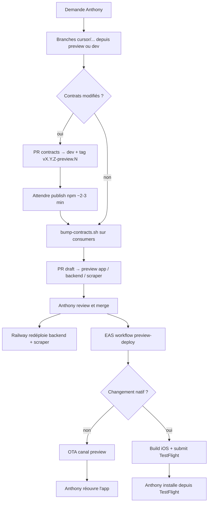

# Agent Cloud Plassy — workflow preview

Ce document décrit comment l’agent Cursor doit travailler sur l’écosystème Plassy pour livrer des modifications testables sur l’iPhone d’Anthony, **sans toucher à la prod** et **sans Metro / ngrok**.

## Objectif

Quand Anthony demande une modification :

1. Coder sur des branches dédiées.
2. Ouvrir des **PR draft** vers les branches d’intégration preview.
3. Après merge humain → déploiement automatique (Railway + EAS).
4. Anthony teste sur iPhone (TestFlight ou OTA).

## Architecture preview

| Couche | Repo | Branche cible PR | Déploiement | URL / canal |
|--------|------|------------------|-------------|-------------|
| **App mobile** | `plassy-app` | `preview` | EAS Workflow sur push `preview` | Canal OTA `preview`, TestFlight |
| **Backend API** | `plassy-backend` | `preview` | Railway auto sur push `preview` | `https://plassy-backend-preview.up.railway.app` |
| **Scraper** | `plassy-scraper` | `preview` | Railway auto sur push `preview` | Réseau privé Railway (`*.railway.internal`) |
| **Contrats** | `plassy-contracts` | `dev` | Tag npm → GitHub Packages | Pas de branche `preview` |
| **Frontend web** | `plassy-frontend` | `dev` ou `main` | Hors scope preview mobile | — |
| **Parapluie** | `Plassy` (racine) | `main` / `dev` | CI uniquement | — |

### Environnements

| Env | Backend app | Backend Railway | Données |
|-----|-------------|-----------------|---------|
| **Preview** | `EXPO_PUBLIC_BACKEND_URL=https://plassy-backend-preview.up.railway.app` | Branche `preview` | DB Neon preview, Redis/S3 preview isolés |
| **Production** | `https://api.plassy.fr` | Branche `main` | Prod |

**Ne jamais** pointer le profil `preview` vers `api.plassy.fr`. **Ne jamais** utiliser ngrok dans un build EAS preview (bloqué dans le code).

### Expo / EAS

| Élément | Valeur |
|---------|--------|
| Org Expo | `@plassy/plassy` |
| Projet | `@plassy/plassy` (`extra.eas.projectId`: `8be05f22-a61c-4959-a5d6-a526667fc22a`) |
| `app.json` → `owner` | `"plassy"` (doit correspondre à l’org Expo) |
| Repo GitHub connecté | `Plassy-App/Plassy-App` |
| Profil build | `preview` (`distribution: store`, `environment: preview`, canal `preview`) |
| Workflow | `.eas/workflows/preview-deploy.yml` (trigger `on.push: preview`) |
| Submit TestFlight | `submit.preview.ios.ascAppId`: `6762057582` |

## Flux standard (une demande de feature)



### Étapes agent

1. **Initialiser les submodules** si besoin : `git submodule update --init --recursive`.
2. **Créer une branche** par repo touché : `cursor/<description>-8d3b` (depuis `preview` pour app/backend/scraper, depuis `dev` pour contracts).
3. **Implémenter** les changements en respectant les conventions du repo.
4. **Ouvrir des PR draft** :
   - `plassy-app` → base `preview`
   - `plassy-backend` → base `preview`
   - `plassy-scraper` → base `preview`
   - `plassy-contracts` → base `dev`
5. **Décrire dans chaque PR** : scope, ordre de merge, action attendue côté testeur.
6. **Attendre le merge** humain — ne pas merger soi-même sauf instruction explicite.

Après merge sur `preview` (app) :

- Le workflow EAS se déclenche **automatiquement**.
- **Modif JS/TS seulement** → OTA (~2–3 min) : Anthony **réouvre l’app**, pas de nouveau TestFlight.
- **Modif native** (plugins Expo, permissions, Mapbox, share extension, bump `appVersion`, etc.) → build + submit TestFlight (~15–25 min) : Anthony **installe le nouveau build**.

## Contrats (`plassy-contracts`)

Le package `@plassy-app/api-contracts` est publié sur **GitHub Packages**, pas déployé sur Railway.

### Quand les contrats changent

Ordre **obligatoire** :

1. Modifier `plassy-contracts` sur branche depuis `dev`.
2. Bumper la version en **prerelease** dans `package.json` (ex. `3.5.0-preview.1`).
3. Mettre à jour `CHANGELOG.md`.
4. PR draft → `dev`.
5. **Pousser le tag** (déclenche le publish, même si la PR est encore ouverte) :
   ```bash
   git tag v3.5.0-preview.1
   git push origin v3.5.0-preview.1
   ```
6. Attendre la fin du workflow `publish.yml` (~2–3 min).
7. Bumper les consumers :
   ```bash
   ./scripts/bump-contracts.sh 3.5.0-preview.1
   ```
8. Commit `package.json` + lockfile dans `plassy-backend`, `plassy-scraper`, `plassy-app`.
9. PR backend/scraper/app → `preview`.
10. Anthony merge → Railway puis EAS.

### Tags acceptés

Le workflow `publish.yml` publie sur :

- `v*.*.*` — releases stables (prod)
- `v*.*.*-preview.*` — prereleases preview

**Ne jamais** bumper `main` (prod) avec une version `-preview`.

### Pinning

Toujours pinner la version exacte : `"@plassy-app/api-contracts": "3.5.0-preview.1"` (pas `^`).

## Backend et scraper

- Branche d’intégration : `preview`.
- Push / merge sur `preview` → Railway redéploie automatiquement l’environnement preview.
- Le backend preview communique avec le scraper via `SCRAPER_URL` (réseau interne Railway) et `SCRAPER_INTERNAL_TOKEN` (partagé entre les deux services preview).
- `APPSTORE_VERIFICATION_ENV=sandbox` sur le backend preview (achats TestFlight / sandbox).

### Coordination API

| Type de changement | Ordre |
|--------------------|-------|
| Champ optionnel ajouté | Backend deploy puis app update — souvent tolérant |
| Champ requis / validation plus stricte | **Backend d’abord**, puis app |
| Nouvelle route | Backend deploy, puis app avec nouveau client |
| Champ supprimé / renommé | Deploy coordonné immédiat |

## App mobile (`plassy-app`)

### Build vs OTA (après merge `preview`)

Le workflow `.eas/workflows/preview-deploy.yml` décide automatiquement via **fingerprint** :

| Situation | Résultat workflow | Action testeur |
|-----------|-------------------|----------------|
| JS/TS seulement (écrans, logique, client API) | `type: update` sur canal `preview` | Réouvrir l’app |
| Changement natif ou pas de build cloud compatible | `type: build` + `type: submit` | Installer depuis TestFlight |

Fichiers typiquement **natifs** (rebuild requis) :

- `app.json` / `app.config.js` (plugins, permissions, version)
- `ios/`, `android/`
- Plugins Expo custom (`plugins/`)
- Dépendances avec code natif (Mapbox, Sentry config native, share extension)
- Bump `runtimeVersion` / `appVersion`

### Variables EAS (environnement `preview`)

Configurées sur expo.dev → Environment variables → `preview` :

- `NODE_AUTH_TOKEN` + `NPM_TOKEN` (même PAT GitHub, scope `read:packages`) — **obligatoire** pour `@plassy-app/api-contracts`
- `EXPO_PUBLIC_MAPBOX_ACCESS_TOKEN`
- `EXPO_PUBLIC_GOOGLE_CLIENT_ID_IOS`
- `EXPO_PUBLIC_IOS_IAP_*`
- `EXPO_PUBLIC_BACKEND_URL` (redondant avec `eas.json`, même valeur Railway preview)
- `SENTRY_AUTH_TOKEN` (recommandé)

`EXPO_PUBLIC_SSL_PIN_SHA256` : **optionnel** (absent sur preview — pinning désactivé, acceptable pour les tests).

### Outils MCP Expo disponibles

L’agent peut utiliser le MCP Expo (déjà authentifié) pour :

| Action | Outil MCP |
|--------|-----------|
| Lister / suivre les builds | `build_list`, `build_info`, `build_logs` |
| Lancer un build manuel | `build_run` |
| Submit TestFlight | `build_submit` |
| Lancer / suivre le workflow | `workflow_run`, `workflow_list`, `workflow_info`, `workflow_logs` |
| Valider un YAML workflow | `workflow_validate` |
| Crashes / feedback TestFlight | `testflight_crashes`, `testflight_feedback` |

**OTA manuel** (si besoin hors workflow) : pas d’outil MCP dédié — utiliser la CLI :

```bash
cd plassy-app
eas update --channel preview --message "..." --non-interactive
```

### Relancer le workflow manuellement

```bash
cd plassy-app
eas workflow:run preview-deploy.yml --ref preview
```

Ou via MCP : `workflow_run` avec `workflowFile: "preview-deploy.yml"`, `gitRef: "preview"`.

## Conventions git

### Nommage des branches agent

```
cursor/<description-courte>-8d3b
```

Exemples : `cursor/fix-login-preview-8d3b`, `cursor/add-place-filter-8d3b`.

### PR

- Toujours en **draft** sauf instruction contraire.
- Une PR par repo touché.
- Titre clair en anglais (convention repos).
- Corps de PR : résumé, repos impactés, ordre de merge, instructions de test.

### Monorepo parapluie

Après merge dans un sous-module, mettre à jour le pointeur submodule dans `Plassy` si Anthony le demande :

```bash
cd plassy-app  # ou autre submodule
git push origin preview
cd ..
git add plassy-app
git commit -m "chore: bump plassy-app submodule (preview)"
git push
```

## Livrable attendu par tâche

À la fin d’une tâche preview :

1. **Branches + PR draft** sur chaque repo concerné.
2. **Tag contracts** publié si applicable (avec version prerelease).
3. **Instructions de merge** : ordre si plusieurs PR (contracts → backend/scraper → app).
4. **Après merge** (si Anthony le demande) : vérifier le workflow EAS via MCP et confirmer OTA ou build TestFlight.
5. **Message de test** pour Anthony :
   - OTA : « Merge fait — réouvre l’app preview pour récupérer l’update »
   - Natif : « Merge fait — nouveau build sur TestFlight dans ~20 min »
   - Backend : « API preview redéployée sur Railway »

## Interdictions

| Action | Pourquoi |
|--------|----------|
| `EXPO_PUBLIC_BACKEND_URL` ngrok en preview | Crash au démarrage (guard dans `lib/api/client.ts`) |
| Preview → `api.plassy.fr` | Risque sur données prod |
| `eas build --profile production` pour tester | Réservé aux releases store |
| `bun link` contracts en CI/EAS | Dev local uniquement — utiliser npm publish |
| Bumper `main` avec version `-preview` | Isole la prod des prereleases |
| Merger sans review sauf demande explicite | Gate humain voulu |

## Dépannage workflow EAS

| Erreur | Cause probable | Fix |
|--------|----------------|-----|
| `401` sur `@plassy-app/api-contracts` | `NODE_AUTH_TOKEN` / `NPM_TOKEN` invalide dans env EAS `preview` | Recréer les secrets sur expo.dev |
| Owner mismatch (`sweizeur` vs `plassy`) | `app.json` → `owner` pas aligné avec l’org Expo | `"owner": "plassy"` |
| `No repository found for appId` | Repo GitHub non connecté à EAS | Connecter `Plassy-App/Plassy-App` sous org `@plassy` |
| OTA ne s’applique pas | App installée depuis build `--local` | Installer le build cloud preview via TestFlight |
| Workflow skip OTA, fait build | Premier build cloud ou changement natif | Normal — attendre TestFlight |

## Références

| Fichier | Rôle |
|---------|------|
| `plassy-app/eas.json` | Profils build/submit preview |
| `plassy-app/.eas/workflows/preview-deploy.yml` | CI/CD preview auto |
| `plassy-app/app.json` | Owner Expo, projectId, runtimeVersion |
| `scripts/bump-contracts.sh` | Bump consumers après publish |
| `plassy-contracts/MIGRATION.md` | Cycle release contracts |
| `plassy-contracts/.github/workflows/publish.yml` | Publish npm (stable + preview tags) |
| `README.md` | Setup monorepo, scripts racine |

## Checklist rapide par type de tâche

### UI / logique app seulement

- [ ] Branche `cursor/...` depuis `preview` dans `plassy-app`
- [ ] PR draft → `preview`
- [ ] Merge → OTA auto

### Backend seulement (même contrat)

- [ ] Branche depuis `preview` dans `plassy-backend` (+ scraper si impact scraping)
- [ ] PR draft → `preview`
- [ ] Merge → Railway redeploy

### Full-stack avec contrats

- [ ] PR + tag `vX.Y.Z-preview.N` sur `plassy-contracts`
- [ ] Attendre publish npm
- [ ] `bump-contracts.sh` + PR backend/scraper/app → `preview`
- [ ] Merge backend/scraper d’abord, puis app
- [ ] Vérifier workflow EAS

### Changement natif app

- [ ] PR → `preview`
- [ ] Merge → build + TestFlight (pas OTA seul)
- [ ] Prévenir Anthony d’installer le nouveau build
