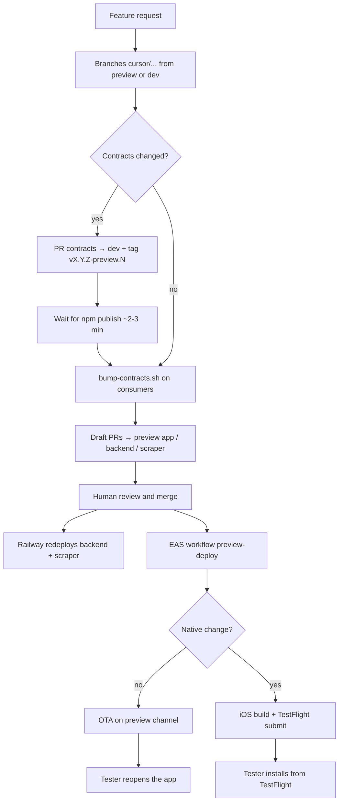

# Plassy Cloud Agent — Preview Workflow

This document describes how Cursor Cloud Agents should work across the Plassy ecosystem to deliver changes testable on a physical iOS device, **without touching production** and **without Metro / ngrok**.

## Goal

When a preview task is requested:

1. Implement changes on dedicated branches.
2. Open **draft PRs** targeting preview integration branches.
3. After human merge → automatic deployment (Railway + EAS).
4. The tester validates on a physical device (TestFlight or OTA).

## Preview architecture

| Layer | Repo | PR target branch | Deployment | URL / channel |
|-------|------|------------------|------------|---------------|
| **Mobile app** | `plassy-app` | `preview` | EAS Workflow on push to `preview` | OTA channel `preview`, TestFlight |
| **Backend API** | `plassy-backend` | `preview` | Railway auto-deploy on push to `preview` | `https://plassy-backend-preview.up.railway.app` |
| **Scraper** | `plassy-scraper` | `preview` | Railway auto-deploy on push to `preview` | Private Railway network (`*.railway.internal`) |
| **Contracts** | `plassy-contracts` | `dev` | npm tag → GitHub Packages | No `preview` branch |
| **Web frontend** | `plassy-frontend` | `dev` or `main` | Out of mobile preview scope | — |
| **Umbrella** | `Plassy` (root) | `main` / `dev` | CI only | — |

### Environments

| Env | App backend URL | Railway branch | Data |
|-----|-----------------|----------------|------|
| **Preview** | `EXPO_PUBLIC_BACKEND_URL=https://plassy-backend-preview.up.railway.app` | `preview` | Isolated Neon preview DB, Redis/S3 preview |
| **Production** | `https://api.plassy.fr` | `main` | Production |

**Never** point the `preview` profile at `api.plassy.fr`. **Never** use ngrok in an EAS preview build (blocked in code).

### Expo / EAS

| Item | Value |
|------|-------|
| Expo org | `@plassy/plassy` |
| Project | `@plassy/plassy` (`extra.eas.projectId`: `8be05f22-a61c-4959-a5d6-a526667fc22a`) |
| `app.json` → `owner` | `"plassy"` (must match the Expo org) |
| Connected GitHub repo | `Plassy-App/Plassy-App` |
| Build profile | `preview` (`distribution: store`, `environment: preview`, channel `preview`) |
| Workflow | `.eas/workflows/preview-deploy.yml` (trigger `on.push: preview`) |
| TestFlight submit | `submit.preview.ios.ascAppId`: `6762057582` |

## Standard flow (one feature request)



### Agent steps

1. **Initialize submodules** if needed: `git submodule update --init --recursive`.
2. **Create a branch** per touched repo: `cursor/<description>-7c6d` (from `preview` for app/backend/scraper, from `dev` for contracts).
3. **Implement** changes following each repo's conventions.
4. **Open draft PRs**:
   - `plassy-app` → base `preview`
   - `plassy-backend` → base `preview`
   - `plassy-scraper` → base `preview`
   - `plassy-contracts` → base `dev`
5. **Describe in each PR**: scope, merge order, expected testing actions.
6. **Wait for human merge** — do not merge unless explicitly instructed.

After merge to `preview` (app):

- The EAS workflow triggers **automatically**.
- **JS/TS changes only** → OTA (~2–3 min): the tester **reopens the app**; no new TestFlight build required.
- **Native changes** (Expo plugins, permissions, Mapbox, share extension, `appVersion` bump, etc.) → build + TestFlight submit (~15–25 min): the tester **installs the new build**.

## Contracts (`plassy-contracts`)

The `@plassy-app/api-contracts` package is published to **GitHub Packages**, not deployed on Railway.

### When contracts change

**Mandatory order**:

1. Modify `plassy-contracts` on a branch from `dev`.
2. Bump the version as a **prerelease** in `package.json` (e.g. `3.5.0-preview.1`).
3. Update `CHANGELOG.md`.
4. Open a draft PR → `dev`.
5. **Push the tag** (triggers publish, even if the PR is still open):
   ```bash
   git tag v3.5.0-preview.1
   git push origin v3.5.0-preview.1
   ```
6. Wait for the `publish.yml` workflow to finish (~2–3 min).
7. Bump consumers:
   ```bash
   ./scripts/bump-contracts.sh 3.5.0-preview.1
   ```
8. Commit `package.json` + lockfile in `plassy-backend`, `plassy-scraper`, and `plassy-app`.
9. Open PRs for backend/scraper/app → `preview`.
10. Human merge → Railway then EAS.

### Accepted tags

The `publish.yml` workflow publishes on:

- `v*.*.*` — stable releases (production)
- `v*.*.*-preview.*` — preview prereleases

**Never** bump `main` (production) with a `-preview` version.

### Pinning

Always pin the exact version: `"@plassy-app/api-contracts": "3.5.0-preview.1"` (not `^`).

## Backend and scraper

- Integration branch: `preview`.
- Push / merge to `preview` → Railway auto-redeploys the preview environment.
- The preview backend talks to the scraper via `SCRAPER_URL` (internal Railway network) and `SCRAPER_INTERNAL_TOKEN` (shared between both preview services).
- `APPSTORE_VERIFICATION_ENV=sandbox` on the preview backend (TestFlight / sandbox purchases).

### API coordination

| Change type | Order |
|-------------|-------|
| Optional field added | Backend deploy then app update — usually tolerant |
| Required field / stricter validation | **Backend first**, then app |
| New route | Backend deploy, then app with new client |
| Field removed / renamed | Coordinated deploy immediately |

## Mobile app (`plassy-app`)

### Build vs OTA (after merge to `preview`)

The `.eas/workflows/preview-deploy.yml` workflow decides automatically via **fingerprint**:

| Situation | Workflow result | Tester action |
|-----------|-----------------|---------------|
| JS/TS only (screens, logic, API client) | `type: update` on channel `preview` | Reopen the app |
| Native change or no compatible cloud build | `type: build` + `type: submit` | Install from TestFlight |

Files that are typically **native** (rebuild required):

- `app.json` / `app.config.js` (plugins, permissions, version)
- `ios/`, `android/`
- Custom Expo plugins (`plugins/`)
- Dependencies with native code (Mapbox, native Sentry config, share extension)
- `runtimeVersion` / `appVersion` bump

### EAS variables (environment `preview`)

Configured on expo.dev → Environment variables → `preview`:

- `NODE_AUTH_TOKEN` + `NPM_TOKEN` (same GitHub PAT, scope `read:packages`) — **required** for `@plassy-app/api-contracts`
- `EXPO_PUBLIC_MAPBOX_ACCESS_TOKEN`
- `EXPO_PUBLIC_GOOGLE_CLIENT_ID_IOS`
- `EXPO_PUBLIC_IOS_IAP_*`
- `EXPO_PUBLIC_BACKEND_URL` (redundant with `eas.json`, same Railway preview value)
- `SENTRY_AUTH_TOKEN` (recommended)

`EXPO_PUBLIC_SSL_PIN_SHA256`: **optional** (absent on preview — pinning disabled, acceptable for testing).

### Available Expo MCP tools

The agent can use the Expo MCP (already authenticated) for:

| Action | MCP tool |
|--------|----------|
| List / track builds | `build_list`, `build_info`, `build_logs` |
| Trigger a manual build | `build_run` |
| Submit to TestFlight | `build_submit` |
| Run / track workflow | `workflow_run`, `workflow_list`, `workflow_info`, `workflow_logs` |
| Validate workflow YAML | `workflow_validate` |
| TestFlight crashes / feedback | `testflight_crashes`, `testflight_feedback` |

**Manual OTA** (if needed outside the workflow): no dedicated MCP tool — use the CLI:

```bash
cd plassy-app
eas update --channel preview --message "..." --non-interactive
```

### Re-run the workflow manually

```bash
cd plassy-app
eas workflow:run preview-deploy.yml --ref preview
```

Or via MCP: `workflow_run` with `workflowFile: "preview-deploy.yml"`, `gitRef: "preview"`.

## Git conventions

### Agent branch naming

```
cursor/<short-description>-7c6d
```

Examples: `cursor/fix-login-preview-7c6d`, `cursor/add-place-filter-7c6d`.

### PRs

- Always **draft** unless instructed otherwise.
- One PR per touched repo.
- Clear title in English (repo convention).
- PR body: summary, impacted repos, merge order, testing instructions.

### Umbrella monorepo

After a submodule PR is merged on GitHub, the latest commit already exists on the remote. To update the submodule pointer in the parent repository, **pull** those changes locally inside the submodule — do not push from the submodule.

```bash
cd plassy-app  # or another submodule
git fetch origin
git checkout origin/preview
cd ..
git add plassy-app
git commit -m "chore: bump plassy-app submodule (preview)"
git push
```

Only do this when explicitly requested for the umbrella repo.

## Expected deliverables per task

At the end of a preview task:

1. **Branches + draft PRs** on each concerned repo.
2. **Contracts tag** published if applicable (prerelease version).
3. **Merge instructions**: order when multiple PRs exist (contracts → backend/scraper → app).
4. **After merge** (if requested): verify the EAS workflow via MCP and confirm OTA or TestFlight build.
5. **Testing message**:
   - OTA: "Merge complete — reopen the preview app to fetch the update"
   - Native: "Merge complete — new TestFlight build in ~20 min"
   - Backend: "Preview API redeployed on Railway"

## Prohibited actions

| Action | Why |
|--------|-----|
| `EXPO_PUBLIC_BACKEND_URL` with ngrok in preview | Crash on startup (guard in `lib/api/client.ts`) |
| Preview → `api.plassy.fr` | Risk to production data |
| `eas build --profile production` for testing | Reserved for store releases |
| `bun link` contracts in CI/EAS | Local dev only — use npm publish |
| Bump `main` with a `-preview` version | Keeps production isolated from prereleases |
| Merge without review unless explicitly asked | Human gate is intentional |

## EAS workflow troubleshooting

| Error | Likely cause | Fix |
|-------|--------------|-----|
| `401` on `@plassy-app/api-contracts` | Invalid `NODE_AUTH_TOKEN` / `NPM_TOKEN` in EAS `preview` env | Recreate secrets on expo.dev |
| Owner mismatch (`sweizeur` vs `plassy`) | `app.json` → `owner` not aligned with Expo org | `"owner": "plassy"` |
| `No repository found for appId` | GitHub repo not connected to EAS | Connect `Plassy-App/Plassy-App` under org `@plassy` |
| OTA does not apply | App installed from a `--local` build | Install the cloud preview build via TestFlight |
| Workflow skips OTA, runs build | First cloud build or native change | Expected — wait for TestFlight |

## References

| File | Role |
|------|------|
| `plassy-app/eas.json` | Preview build/submit profiles |
| `plassy-app/.eas/workflows/preview-deploy.yml` | Auto preview CI/CD |
| `plassy-app/app.json` | Expo owner, projectId, runtimeVersion |
| `scripts/bump-contracts.sh` | Bump consumers after publish |
| `plassy-contracts/MIGRATION.md` | Contracts release cycle |
| `plassy-contracts/.github/workflows/publish.yml` | npm publish (stable + preview tags) |
| `README.md` | Monorepo setup, root scripts |

## Quick checklist by task type

### App UI / logic only

- [ ] Branch `cursor/...` from `preview` in `plassy-app`
- [ ] Draft PR → `preview`
- [ ] Merge → automatic OTA

### Backend only (same contract)

- [ ] Branch from `preview` in `plassy-backend` (+ scraper if scraping is impacted)
- [ ] Draft PR → `preview`
- [ ] Merge → Railway redeploy

### Full-stack with contracts

- [ ] PR + tag `vX.Y.Z-preview.N` on `plassy-contracts`
- [ ] Wait for npm publish
- [ ] `bump-contracts.sh` + PRs for backend/scraper/app → `preview`
- [ ] Merge backend/scraper first, then app
- [ ] Verify EAS workflow

### Native app change

- [ ] PR → `preview`
- [ ] Merge → build + TestFlight (not OTA alone)
- [ ] Notify that a new TestFlight build must be installed
